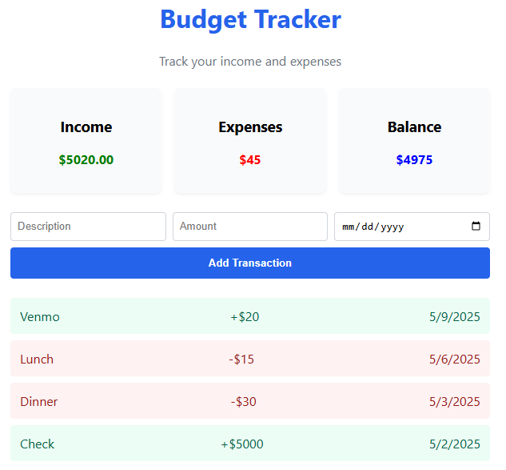

# 💰 BudgetTracker

A full-stack personal finance tracker built with **React** (frontend) and **AWS Lambda + DynamoDB** (backend), deployed via **Terraform**.

]

---

## 🚀 Features

- Track expenses with category, amount, and date
- Store and retrieve data from AWS DynamoDB
- Serverless backend with AWS Lambda (Python)
- Infrastructure-as-Code using Terraform
- CORS-enabled HTTP API via API Gateway
- Clean, responsive frontend using React